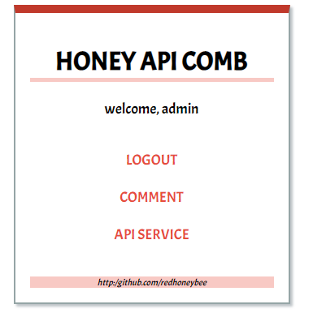
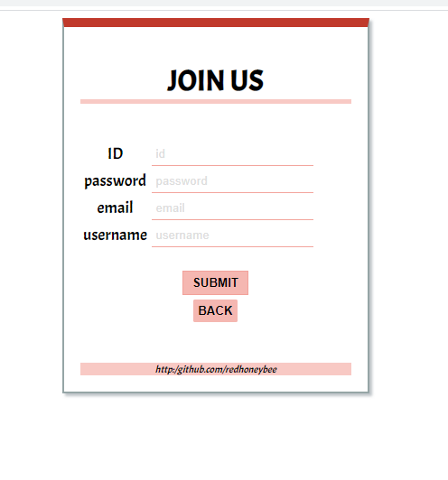
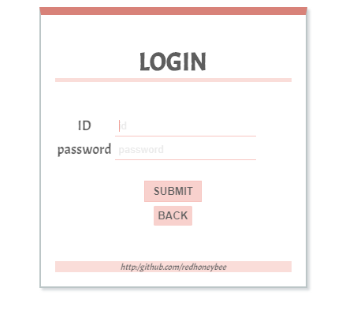
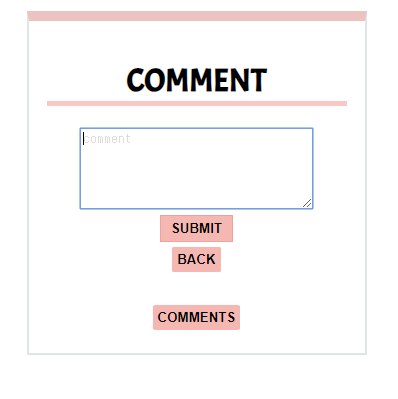
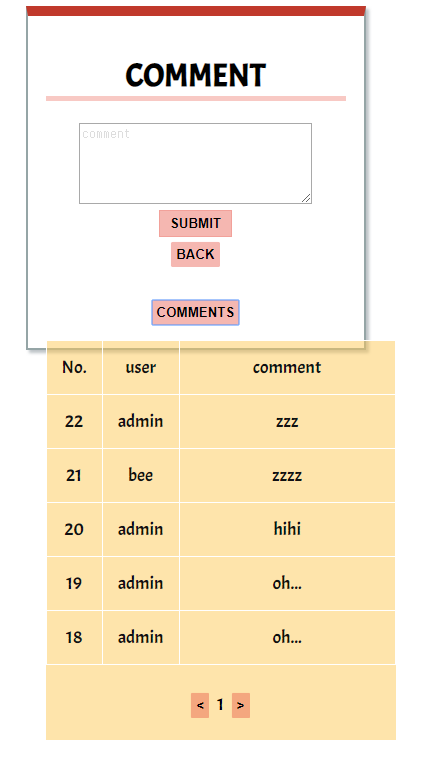
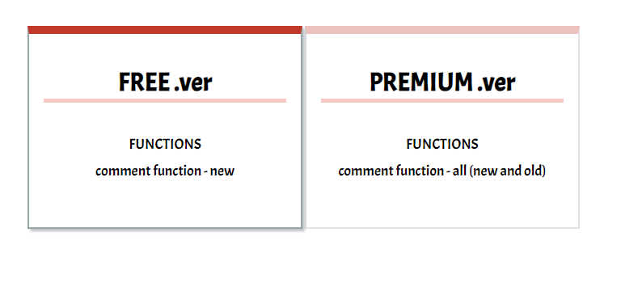
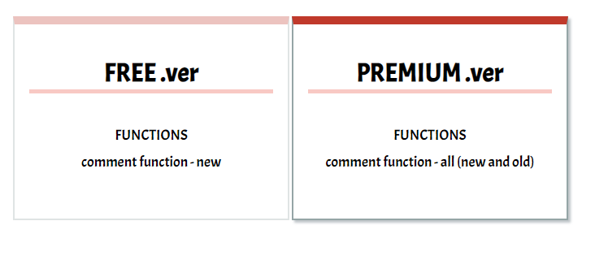

<h1>Honey-APICOMB</h1>

 
<ul>
  <li> lang : javascript (node.js)</li>
  <li> DB : MySQL </li>
</ul>
 
<h2>Functions</h2>

<h3>1. Join, Login (passport - local)</h3> 

 

<h3>2. comments</h3> 
if you don't have that key provided, you can not use the comments function 

 

<h3>3. provide keys</h3> 
There is no differnece between free version key and premium key (Don't development) 

 
 
 

<h3>Thank you for advice</h3>
